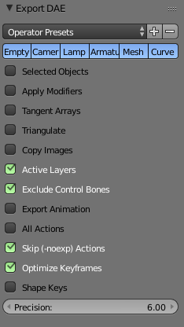
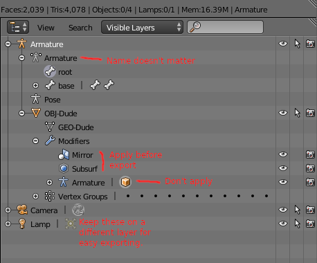

# From Blender to Godot Export

### COLLADA IMPORT-EXPORT

If you want to export 3D animated models from Blender, then you'll need the [Godot Collada Exporter](https://github.com/godotengine/collada-exporter) plugin for Blender.

Godot prefers to receive triangulated meshes. The Triangulate option in the exporter has to be enabled for Godot to know.

When importing your animated meshes, Godot bakes the animation data to a certain framerate. Make sure to choose the appropriate frames per second for your model, then re-import.

For an animated character:

* The Mesh (or meshes) should be a child of the Armature.
* All modifiers except Armature should be applied to mesh before export.
	- So "Apply Modifiers" option doesn't work too well.

For world building:

* Array modifier applies to mesh, so multiple linked objects with different array length will snap to one array length.

### NAME TAGS

You can place a tag at the end of an object's name. These tell Godot how to treat the object while importing (aside from the object's type).

The tag must be at the end of the object's name.

- -colonly turns a mesh into a StaticBody with Collision mesh.
- -col adds a StaticBody with copied mesh data for Collision mesh.
- -vehicle
- -wheel

 

### BLENDER MATERIALS (MAP TEXTURE TO DAE)

The collada exporter (engine importer?) supports Blender Internal Render materials (use Blender 2.79 for these) to some degree. This section is about how to map image textures to your collada file. This works better in Godot 2.1.

